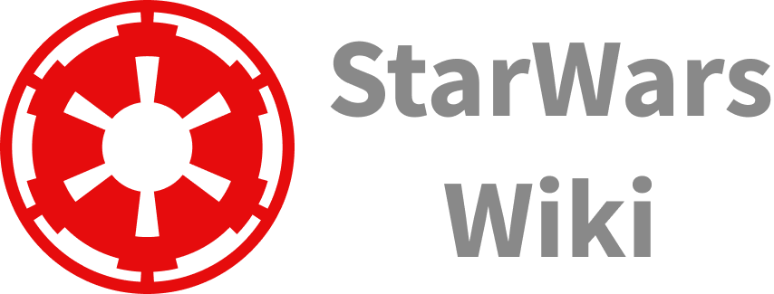

[](README.md)
[](../../README.md)

<h1 align="center">
  
</h1>

<p align="center">
  

 
</p>


## 💻 Description
Application with the main functionality to show movies and characters from the StarWars films, you can add them to your favorites lists and search for characters/movies through their name.
You can preview it by downloading the Expo Go app on your smartphone and scanning the QR Code present [on this page](https://expo.dev/@ericknathan/StarWarsWiki).


## :hammer_and_wrench: Features 

-   [x] Empty search prompt
-   [x] Random ordering of movies and characters
-   [x] Authentication system through Discord oAuth2 
-   [x] Saving bookmarks to database to avoid loss on other devices
-   [ ] Redirection for if the user is not connected to the internet

## ✨ Technologies

- [Node.JS](https://nodejs.org/en/)
- [React Native](https://facebook.github.io/react-native/)
- [Typescript](https://www.typescriptlang.org/)
- [Expo](https://docs.expo.io/)
- [Expo Auth Session](https://docs.expo.dev/versions/latest/sdk/auth-session/)
- [Expo Google Fonts](https://expo.io/@exponent/google-fonts/)
- [Styled Components](https://styled-components.com/)
- [Firebase](https://firebase.google.com/)
- [Zustand](https://github.com/pmndrs/zustand/)
- [Async Storage](https://docs.expo.io/versions/latest/sdk/async-storage/)
- [IonIcons](http://ionicons.com/)
- [Axios](https://github.com/axios/axios/)
- [React Navigation](https://reactnavigation.org/)
- [Linear Gradient](https://docs.expo.io/versions/latest/sdk/linear-gradient/)
- [React Native Youtube Iframe](https://github.com/LonelyCpp/react-native-youtube-iframe/)


## 🔖 Layout

You can view the project layout through [this link](https://www.figma.com/file/FcJqDIFJpy43Zik4QhoJ39/DevRiseWeek-StarWars?node-id=2%3A2). You must have a [Figma](http://figma.com/) account to access it.


## Running the project

First you will need to install the project dependencies, in this case Expo and [Android Studio](https://developer.android.com/studio) to run the application on your machine if you want.
```cl
npm install --global expo-cli
```

Clone the project and use the package manager to install project dependencies.
```cl
git clone https://github.com/ericknathan/starwars-wiki.git
yarn install ou npm install
```

Remember to create your App on Discord server to obtain authentication credentials and configure Realtime Database on Google Firebase service. Then define your App's settings in the .env file (remove the .example of file .env.example).
 
 ```cl
REDIRECT_URI=
SCOPE=identify%20email%20connections%20guilds
RESPONSE_TYPE=token
CLIENT_ID=
CDN_IMAGE=https://cdn.discordapp.com

FIREBASE_API_KEY=
FIREBASE_AUTH_DOMAIN=
FIREBASE_PROJECT_ID=
FIREBASE_STORAGE_BUCKET=
FIREBASE_MESSAGING_SENDER_ID=
FIREBASE_APP_ID=
```


Then start the project.
```cl
expo start

// Press "a" to run the application on android emulator or "i" to run the application on ios
```

## Useful links
- [Project published at the expo](https://expo.dev/@sevencoders/StarWarsWiki)
- [Lesson playlist (Portuguese only)](https://www.youtube.com/playlist?list=PL4zG19BCs4pdPJzElbUxCykHTClU-B0Ts)
- [Used API](https://sevencoders-starwars-wiki.herokuapp.com)

## 📄 License

This project is under the MIT license. See the [LICENSE](../../LICENSE) file for more details.

<br />