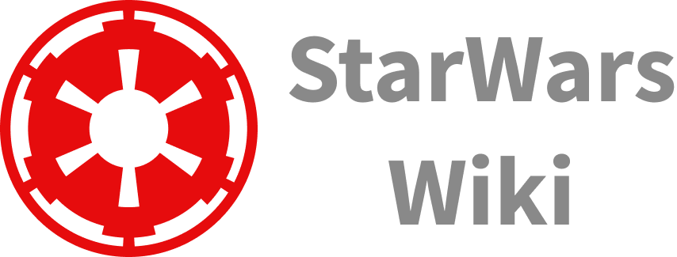

<h1 align="center">
  
</h1>

<p align="center">
  

 
</p>


## 💻 Projeto
Aplicativo com a principal funcionalidade de mostrar filmes e personagens da franquia StarWars, você pode adicioná-los às suas listas de favoritos e procurar personagens/filmes através de seu nome.


## :hammer_and_wrench: Features 

-   [ ] Lorem Ipsum.

## ✨ Tecnologias

- [Node.JS](https://nodejs.org/en/)
- [React Native](https://facebook.github.io/react-native/)
- [Typescript](https://www.typescriptlang.org/)
- [Expo](https://docs.expo.io/)
- [Styled Components](https://styled-components.com/)
- [Zustand](https://github.com/pmndrs/zustand/)
- [Async Storage](https://docs.expo.io/versions/latest/sdk/async-storage/)
- [IonIcons](http://ionicons.com/)
- [Axios](https://github.com/axios/axios/)
- [Expo Google Fonts](https://expo.io/@exponent/google-fonts/)
- [React Navigation](https://reactnavigation.org/)
- [Linear Gradient](https://docs.expo.io/versions/latest/sdk/linear-gradient/)
- [React Native Youtube Iframe](https://github.com/LonelyCpp/react-native-youtube-iframe/)


## 🔖 Layout

Você pode visualizar o layout do projeto através [desse link](https://www.figma.com/file/FcJqDIFJpy43Zik4QhoJ39/DevRiseWeek-StarWars?node-id=2%3A2). É necessário ter conta no [Figma](http://figma.com/) para acessá-lo.


## Executando o projeto

Primeiro será necessário instalar as dependências do projeto, neste caso o Expo e o [Android Studio](https://developer.android.com/studio) para executar a aplicação em sua máquina caso desejar.
```cl
npm install --global expo-cli
```

Clone o projeto e utilize o instalador de pacotes para instalar as dependências do projeto.
```cl
git clone https://github.com/ericknathan/starwars-wiki.git
yarn install ou npm install
```

Em seguida, inicie o projeto.
```cl
expo start

// Digite "a" para rodar a aplicação no emulador android ou "i" para rodar a aplicação no ios
```

## Links Úteis
- [Projeto públicado no expo](https://expo.dev/@sevencoders/StarWarsWiki)
- [Playlist das aulas](https://www.youtube.com/playlist?list=PL4zG19BCs4pdPJzElbUxCykHTClU-B0Ts)
- [API Utilizada](https://sevencoders-starwars-wiki.herokuapp.com)

## 📄 Licença

Esse projeto está sob a licença MIT. Veja o arquivo [LICENSE](LICENSE) para mais detalhes.

<br />